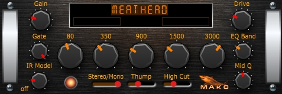

# MakoMeatHead
* JUCE VST High Gain Amp Sim
* Demo JUCE program. Sample code.
* Tested on Windows only.
* Written in Visual C++ 2022.
* Written for new programmers, not complicated.
* Version: 1.00
* Posted: June 27, 2024

VERSION
------------------------------------------------------------------
1.00 - Initial release.

DISCLAIMER
------------------------------------------------------------------  
This VST was written in a very simple way. No object defs, etc. 
Just simple code for people who are not programmers but want to 
dabble in the magic of JUCE VSTs.

SUMMARY
------------------------------------------------------------------
A Juce/C++ VST written to simulate a guitar amplifier. 



# THEORY OF OPERATION<br />
This VST is designed to mimic a high gain amplifier. It uses
a typical OverDrive/Distortion pedal technique of passing the
guitar signal into a 650 Hz Band Pass filter and then distorting
the signal. A higher frequency push is added as the midrange filter Q is increased.<br />

The basic signal path is:  
Signal Thinner -> High Pass Filter -> High Freq Boost -> 650 Hz Bandpass -> Distortion -> 5 Band EQ -> Thump  

SIGNAL THINNER  
As the gain is increased, the noise floor gets louder and louder. Eventually you start to hear things that are not
supposed to be heard. The thinner reduces the guitar input signal the harder we go into distortion.

HIGH PASS FILTER  
The higher the gain, the less bass you want going into the distortion stage. This filter is set to 150 Hz to match 
the 150 Hz of Thump. But a setting of 180, 200, 220 is not unreasonable. Experiment. The more bass present at distortion, the
more flubby and undefined your sound will be.

HIGH FREQ BOOST  
This code adds in some high frequency signal as the midrange bandpass filter Q is increased. The higher the Q, the less Lows and High 
are present. Without this boost, the sound may be to dead and soft. Experiment.

650 HZ BANDPASS FILTER  
This was selected to give us a honky sounding low mid boost. This works well for 7 string guitars etc. The Q of the filter adjusts the Highs,
Lows, and the WAH sound. The Q setting is crucial to finding the right sound.

DISTORTION STAGE  
The guitar signal is amplified to extreme levels and then clipped. An angled clipping setup is used. It is not necessary, as the
distortion level is ridiculous. So comment it out and try something else.

5 BAND EQ  
As the distortion goes up, the EQ becomes crucial. For typical 7 string setups, you may want to lower EQ bands 2, 3, and 4. Because the
bass and highs are the meat and potatoes of the sound. A Low Pass filter is added and sounds good at around 4000-4800 Hz. If it is set to 8000 Hz
it turns off and lets everything thru.

THUMP  
Thump adds a boosted 150 Hz signal to the sound. A good starting point is to set Thump at around .20 and then adjust the lowest EQ band to taste. Of course,
there is nothing stopping you from going to 11!

# NOTED JUCE CODE 
CLIPPING  
A Timer is created in the EDITOR that gets called twice per second. If the PROCESSOR code detects a clip(volume too loud), it sets a flag. This flag is read
in the Editor Timer and CLIPPING is posted to the UI if true.

This is the basic method you would use for VU meters, etc. Set a value in the processor, detect and display it in the editor TIMER.

SINGLE VALUE MONITORING  
Normally a JUCE slider control is setup to have an associated TEXTBOX object. To give our AMP UI a sleek look we have turned all textboxes off. They are not needed in this VST.
Instead, we have a single LABEL object on the UI that we fill in with our slider data as it is being edited. 

CUSTOM SLIDER UI  
We have an override function declared to take control of the drawing routines for our sliders. Each slider also has a few tick mark settings available. We are cheating and using
some of the sliders color properties to get info about our slider that doesnt exist in the default JUCE control. For instance a slider color is used to indicate the tick mark style to use.

# CUSTOM SLIDER OVERVIEW  
Juce has built in functions to draw the slider objects you use. The power of C++ lets us copy the slider object and then take control of the prebuilt functions. 
To do this we need to declare our own Slider Object that pulls its defintion from the Juce object. This is done in the top of PluginEditor.h.
```C++
class MakoLookAndFeel : public juce::LookAndFeel_V4
```  
This creates OUR own slider class. Now we need to tell C++ to use our functions instead of the Juce defined functions. This is done by replicating the function and using the OVERRIDE statement.
```C++
void drawRotarySlider(juce::Graphics& g, int x, int y, int width, int height, float sliderPos, const float rotaryStartAngle, const float rotaryEndAngle, juce::Slider& sld) override
{
}
```
In order to use this new class, we need to declare it as a variable in PlugInEditor.h:
```C++
MakoLookAndFeel myLookAndFeel;
```
The next step is to tell Juce to use our class instead of its normal class. This is done in PlugInEditor.cpp.
```C++
//R1.00 Override the default Juce drawing routines and use ours.
slider->setLookAndFeel(&myLookAndFeel);
```
In this app we have a dereferenced slider being used. If the slider is normal you would just do MySlider.setLookAndFeel(&myLookAndFeel). Assuming your Slider control is named MySlider.

DRAWING A KNOB USING PATHS  
Our Slider control will use the PATH method of drawing a shape. This shape can be drawn or filled in. All of this code resides on OUR new Slider class of course.

Step one is to define the PATH: 
```C++
float Kpts[32];
juce::Path pathKnob;

 //R1.00 Define the Path points to make a knob (Style 3).
 Kpts[0] = -2.65325243300477f;
 Kpts[1] = 8.60001462363607f;
 Kpts[2] = 0.0f;
 Kpts[3] = 10.0f;
 Kpts[4] = 2.65277678639377f;
 Kpts[5] = 8.60016135439157f;
 Kpts[6] = 7.81826556234706f;
 Kpts[7] = 6.23495979109873f;
 Kpts[8] = 8.3778301945593f;
 Kpts[9] = 3.28815468479365f;
 Kpts[10] = 9.74931428347318f;
 Kpts[11] = -2.22505528067641f;
 Kpts[12] = 7.79431009355225f;
 Kpts[13] = -4.4998589050713f;
 Kpts[14] = 4.3390509473009f;
 Kpts[15] = -9.00958583269659f;
 Kpts[16] = 1.34161181197136f;
 Kpts[17] = -8.89944255254108f;
 Kpts[18] = -4.33855264588318f;
 Kpts[19] = -9.00982579958681f;
 Kpts[20] = -6.12133095297134f;
 Kpts[21] = -6.59767439058605f;
 Kpts[22] = -9.74919120703023f;
 Kpts[23] = -2.22559448434896f;
 Kpts[24] = -8.97486228392824f;
 Kpts[25] = .672195644527914f;
 Kpts[26] = -7.81861038843018f;
 Kpts[27] = 6.23452737534543f;
 Kpts[28] = -5.07025014121689f;
 Kpts[29] = 7.4358969536627f;
 Kpts[30] = -2.65325243300477f;
 Kpts[31] = 8.60001462363607f;

 //R1.00 Create the actual PATH for our KNOB style 3.
 pathKnob.startNewSubPath(Kpts[0], Kpts[1]);
 for (int t = 0; t < 32; t += 2)
 {
   pathKnob.lineTo(Kpts[t], Kpts[t + 1]);
 }
 pathKnob.closeSubPath();
```
The knob coordinates were based on a circle size of 10. Using a circle of 1 or unity, would make the scaling easier. Too late we got 10.
Even indexes are X coordinates and Odd indexes are Y coordinates. So we have 16 actual points.

Now we can draw a weird knob shape. 
```C++
//R1.00 Copy our predefined KNOB PATH, scale it, and then transform it to the centre position.
//R1.00 The knob SIZE must be performed first. It is then ROTATED around its center. Then moved (TRANSLATED) to the screen knob position.
juce::Path pK = pathKnob;
pK.applyTransform(juce::AffineTransform::scale(radius / 11.0f).followedBy(juce::AffineTransform::rotation(angle).translated(centreX, centreY)));
ColGrad = juce::ColourGradient(juce::Colour(0xFFC0C0C0), 0.0f, y, juce::Colour(0xFF000000), 0.0f, y + height, false);
g.setGradientFill(ColGrad);
g.strokePath(pK, juce::PathStrokeType(2.0f));
```
We are scaling our knobs to be 1/11th normal size (our coors are based on 10) to make the knobs a little smaller than normal. Should be 1/10, which is a little too big.
We then apply a rotation to the coordinates of the path. Followed by a translation (centering the knob in its position).
This part only draws the outline of the knob, it does not fill it in. The color used is a gradient starting at a lite grey fading to black. 
The path is drawn with strokeParth and is set to be 2 pixels wide.

JUCE TIMER OVERRIDE  
To have information from the processor displayed on the UI, we need a timer in the editor. This is done by adding  it to the editor def.
```C++
class MakoBiteAudioProcessorEditor  : public juce::AudioProcessorEditor , public juce::Slider::Listener, public juce::Timer
```
We then need to override the actual function so that our function gets called instead.
```C++
//R1.00 Override the TIMER so we can capture it and executes our UI code.
void timerCallback() override;
```
Next we tell the editor how often to call our timer. In this case we set it to be called twice a second. More than often enough for our simple CLIPPING warning.
If you were making a VU meter, etc you may want this to be set to 10 or more. Remember, this is all wasting your CPU usage while you are trying to record in the DAW. 
So try to keep it to a minimum. 
```C++
//R1.00 Start our Timer so we can tell the user they are clipping. Could draw VU Meters here, etc.
startTimerHz(2);  //R1.00 have our Timer get called twice per second.
```
In our example we are watching for a public variable in the processor that gets set if we are clipping.
```C++
//R1.00 This func gets called twice a second to monitor processor.
//R1.00 Could be used to draw VU meters, etc. 
void MakoBiteAudioProcessorEditor::timerCallback()
{
    //R1.00 Check if processor audio is clipping.
    //R1.00 Track the Label stats so we are not redrawing the control twice a second.
    if (audioProcessor.AudioIsClipping)
    {
        audioProcessor.AudioIsClipping = false;
        STATE_Clip = true;
        labInfo2.setText("CLIPPING", juce::sendNotification);
    }
    else
    {
        if (STATE_Clip) labInfo2.setText("", juce::sendNotification);
        STATE_Clip = false;
    }
}
```
We check to see if clipping is true. We then reset the varible so it can be ready to flag the next clip.

We are using a flag internally called STATE_Clip. The sole purpose is to not forcing the screen to redraw twice a second. It gets set to true which forces a redraw (labInfo2.setText). 
Then it is set to false so we dont setText agin until necessary. This makes the code hard to read but is a very important thing to remember. You end goal is to make your VST run as
fast as possible. Try not to do too much.

